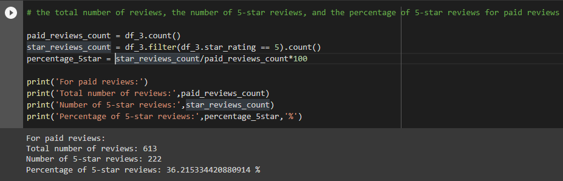
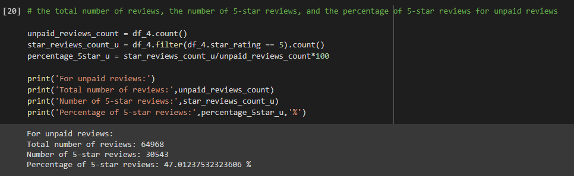

# Amazon Vine Analysis

## Overview of the analysis

In this project, the reviews of the following dataset have analyzed.

Dataset - **amazon_reviews_us_Wireless_v1_00.tsv.gz**

In the analyzing process, first, the data is loaded to the notebook using pyspark methods and then it is filtered by considering some conditional parameters. Then at the end, we get two main data frames for paid and unpaid reviews. Following parameters are calculated for these two data frames.

- **The total number of reviews**

- **The number of 5-star reviews**

- **The percentage of 5-star reviews**

Using these outcomes, we can give statistics about how much bias is there in the reviews.

## Results

Paid reviews:

Unaid reviews:

- There are 613 paid reviews and 64968 unpaid reviews
- Out of above reviews 222 paid reviews are 5 star and 30543 unpaid reviews are 5 star
- Percentage of 5 star reviews for paid reviews is 36.22% and unpaid reviews is 47.01%

## Summary

In the above analyze, we can see that the 5 star review percentage of the upaid review type is higher than the paid review type, therefore we can say that there is a positivity bias towards unpaid reviews.

Other than these analyzing, we can compute statistical parameters like mean, median, variance for the review counts and see the details about their distributions.
